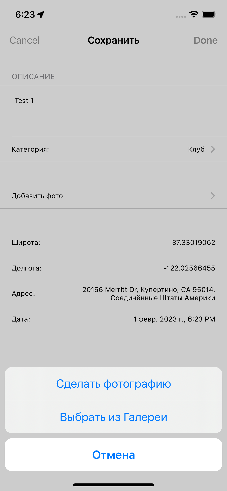
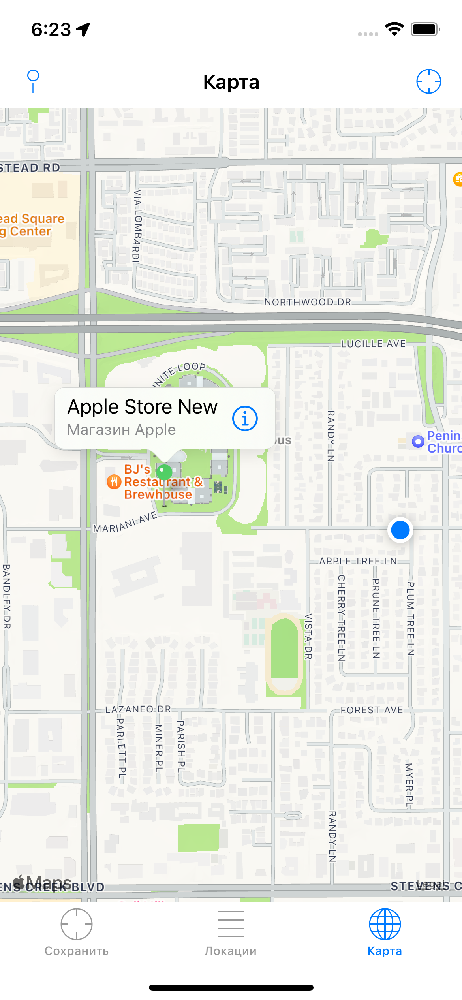
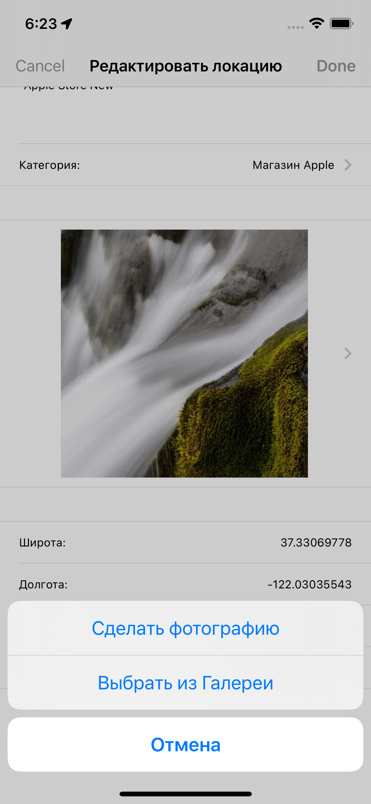

MyLocations

# An application uses GPS to obtian, favorite user location on map

## Demo

       

## Screenshots

    
     
     

## Stack used:

1. UIKit, Storyboard, UITableView
2. CoreLocation, CoreData
3. MapKit
